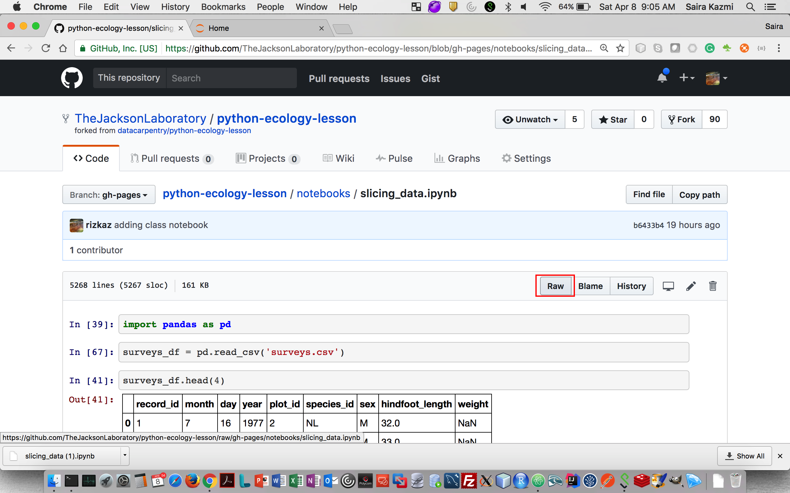
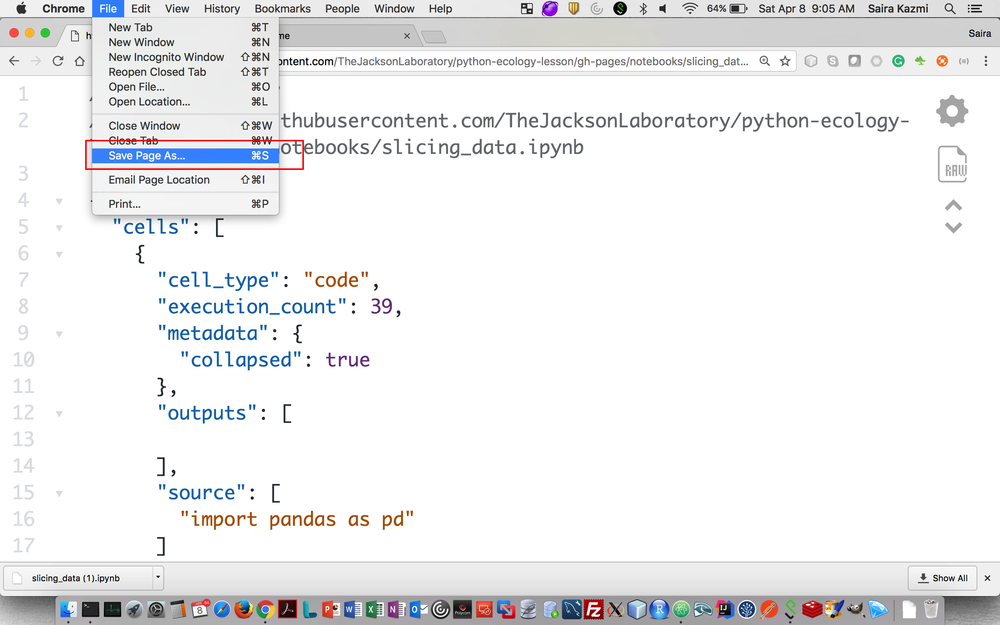
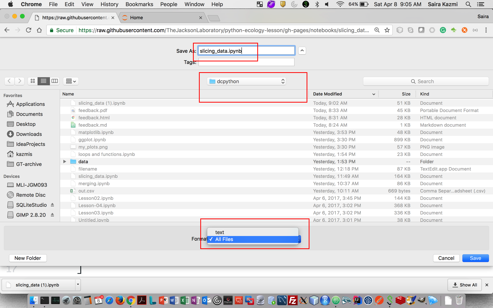
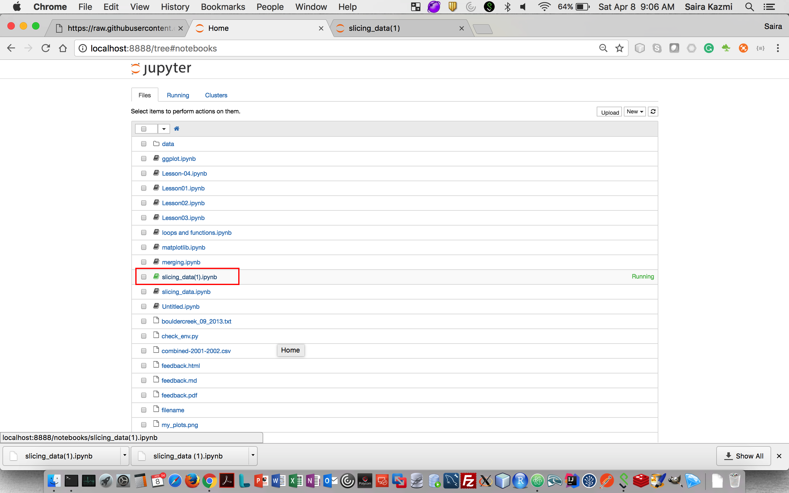
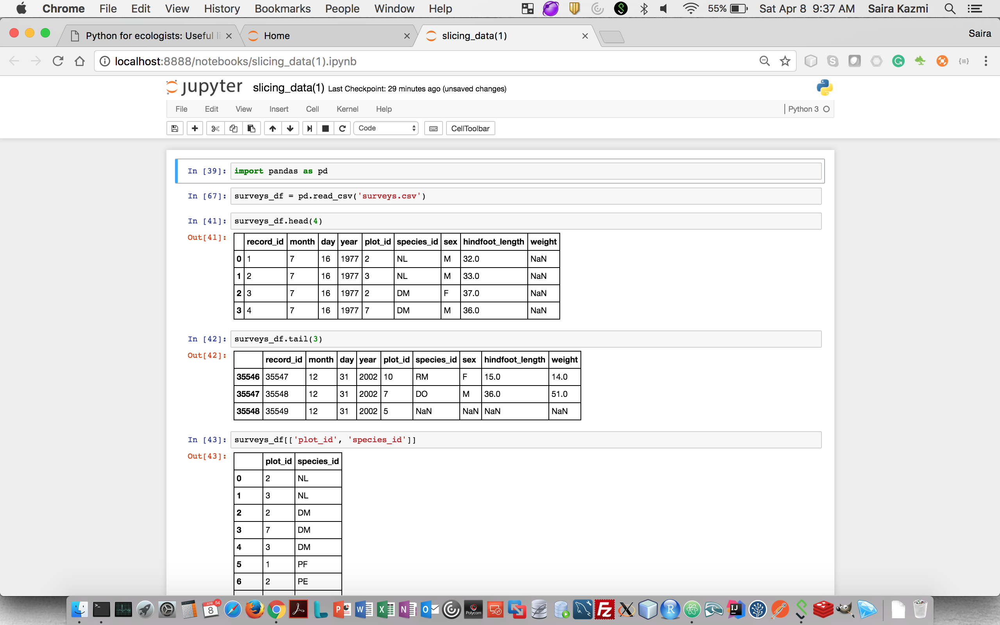

## How to download and open instructor notebooks

  1. Under instructor notebooks, click on the notebook link.

  2. This will take you to the github file location. Follow the link to the `Raw` file.

    

  3. On the raw file page, go to `File` menu on your browser and click on `Save Page As`

      

  4. This will take you to the file save dialogue. Make sure that you save it as `any-file-name.ipynb` with `.ipynb` extension. Also make sure that the `format` is `All Files` and NOT as `text`.

      

  5. Once you start your Jupyter Notebook in the folder with this file, you should be able to open this notebook in the browser.

  Start Jupyter

      

  Open Notebook

      
